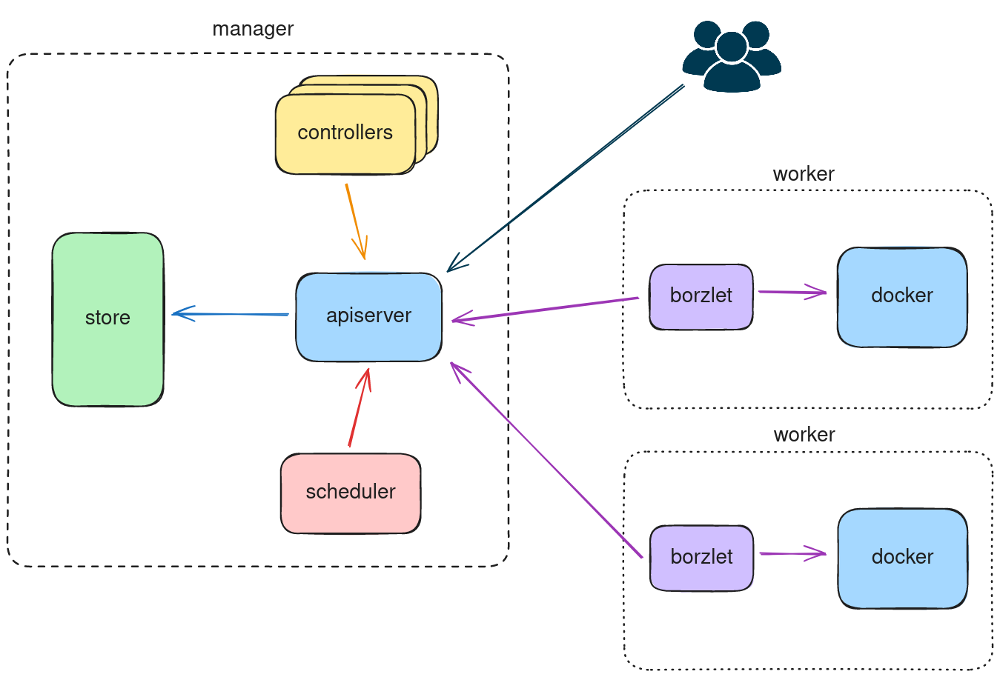

# Borz
Borz is a container orchestration system written in Go.

## Architecture (so far)
Borz follows a similar architecture to Kubernetes. Due to a lack of creativity on my part I use a lot of Kubernetes terminology to refer to resources like pods, deployments, etc. They mean pretty much the same in Borz that they do in Kubernetes.

### Components
The manager is made up of an API server, a scheduler, a few controllers and a store. Worker nodes are made up of the borzlet (totally not inspired by some other component in Kubernetes) and the Docker container runtime.

### How does this all work?
If you're familiar with Kubernetes you should feel at home here. Users send requests to the API server which retrieves/creates resources in the store: the cluster's shared state. The scheduler watches for unscheduled pods through the API server and assigns a suitable worker to them. The borzlet talks to the API server to retrieve new pods to schedule, sends the containers defined in the pods to the Docker runtime and notifies the API server so that it can save the pod state in the store. Pods are but one type of resource. Other resources like deployments are managed by the various controllers. They watch the resources through the API server and make sure their state matches the desired state.